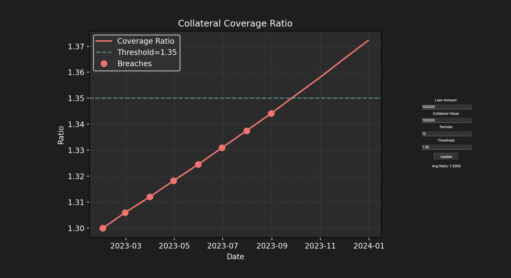

# Collateral Coverage Ratio Tracker

- This Python tool monitors the collateral coverage ratio (collateral value divided by loan amount) for a portfolio of asset-backed loans.
- It features a GUI to input parameters, track ratios over time, and visualize trends with breach detection.

---

## Files
- `collateral_ratio_tracker.py`: Main script for calculating and visualizing collateral coverage ratios with a Tkinter GUI.
- `output.png`: Plot.
- 
---

## Libraries Used
- `pandas`
- `numpy`
- `tkinter`
- `matplotlib`
- `matplotlib.backends.backend_tkagg`

---

## Features
- **Input**: Users specify loan amount, collateral value, number of periods, and a coverage threshold via a GUI.
- **Ratio Calculation**: Computes monthly collateral coverage ratios with synthetic data (loan decreases 10%, collateral decreases 5% over time).
- **Breach Detection**: Identifies periods where the ratio falls below the specified threshold.
- **Visualization**: Displays a real-time plot of the coverage ratio trend, threshold line, and breach points.
- **Metrics**: Shows the average coverage ratio across the period.

## Screenshots

